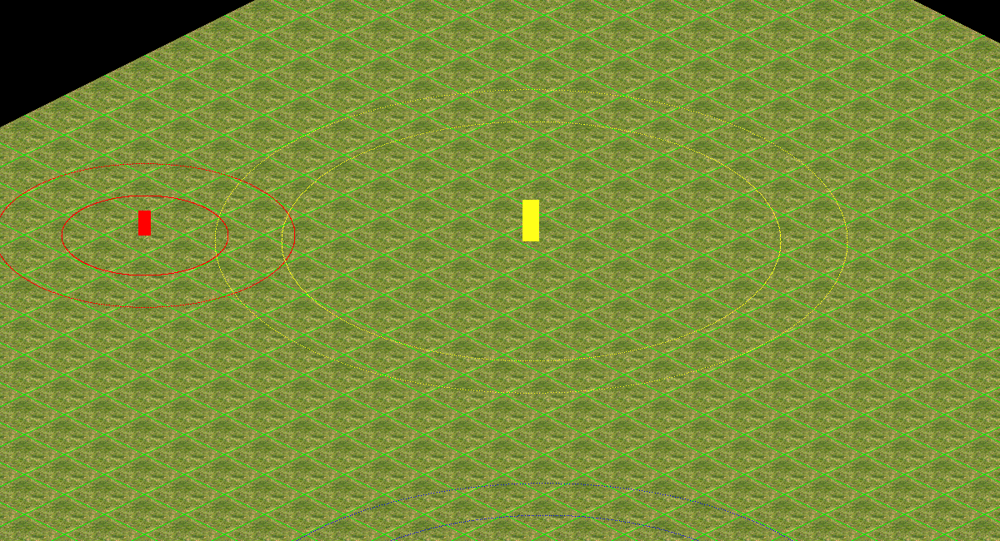

<h1> Fog of War Research </h1>

Visits

Count Here

<h3> Index </h3>
<ul>
<li> <a href="#INTRO"> Introduction </a> </li>
<li> <a href="#CONCEPT"> Concept </a> </li>

<li> <a href="#TYPES"> Fog Types </a> </li>
<li> <a href="#ORIGINS"> Origins </a> </li>
<li> <a href="#TUTORIAL"> Tutorial </a> </li>
<li> <a href="#REFERENCES"> References </a> </li>
<ol/>
</ul>

<h1 id="INTRO"> Introduction </h1>
<ul>

Fog of war is a common concept found in many combat-based real-time and turn-based strategy games. It simulates the unknowns of the battle and provides an exploration incentive to uncover them, forcing the player to rely on imperfect and incomplete information of the battlefield and sometimes improvise based on intuition and common sense.

Here we are going to talk about the concept of the Fog of War and all its variables, the origins, how board games and videogames adapt the concept to engage the user, and finally a tutorial of how to do a fog of war for an RTS game.

</ul>

<h1 id="CONCEPT"> Fog of War Concept </h1>
<ul>

The fog of war is a term used to describe the uncertainty in the situation experienced by participants in military operations. It isn’t limited at the own capability, so it determinates the adversary capability too.

So fog of war is directly related with the fog in a real battle camp and the ambiguity that it generates, but when this concept is transferred to the world of games is not necessary simulated with fog. 

For example, in Battleship the famous board game, there’s no fog but the concept of war ambiguity is present, in fact, is the principal feature of the game.

In videogames is practically the same. It’s true that a lot of videogames simulate the fog of war concept directly with fog but some videogames use other methods. For example, BRAIN / OUT is a shooter that simulates the war ambiguity hiding the players that aren’t doing noisy actions.

Now that we know what really means Fog of War let’s talk about the different ways in which the ambiguity can affect the user and change the game flow.

</ul>

<h1 id="TYPES"> Fog Types </h1>
<ul>

The ambiguity that the fog of war generates can vary according to the level at which participants are engaged.

The different ambiguity levels are:

<ul>
<li><h5> Grand Strategic </h5></li>
<ul>

Ambiguity is related to the political intent, capabilities and logistical strengths of an adversary. Basically we know that there’s an adversary but we don’t know nothing about it. 

A game with this type of fog of war is Age of Empires II. Where we know all about our civilization but nothing about the enemy.

</ul>
<li><h5> Military Strategic </h5></li>

<ul>

Ambiguity is related to the structure, strength, capability, and disposition of own and adversary offensive and defensive assets. The own assets ambiguity can be generated by a bad report of it or unwillingness to watch for them. 

A good example of this fog type is Call of Duty MW3 in hardcore mode. In normal mode the user knows the location of the allied players and the avatar stats, as you can see in the first screenshot. But in hardcore mode the minimap and all the UI related with the stats is hidden as you can see in the second screenshot. So the second frame simulates the military strategic ambiguity.

</ul>
<li><h5> Operational </h5></li>
<ul>

Ambiguity is related with the adversary like the grand strategic but is coupled with own directive ambiguity. So the commander doesn’t have the full sight of the strategic imperative

The example game is Dragons of Atlantis. In this game you can send your units to attack the enemy, but you don’t know the result of the operation since the units return to your domains or a messenger is send.

The first screenshot shows the order and the second shows the result.

</ul>
<li><h5> Tactical </h5></li>

In this case the ambiguity is around several factors at the tactical level. The ambiguity can be related with the interaction between allied troops, their status and their intentions. This lack of comprehension of the tactical environment by the commander aren’t necessary generated by factors inherent to battle. 

</ul>
</ul>
<h1 id="ORIGINS"> Origins </h1>
<ul>

Okay, we have seen all the different features of the fog of war and which mechanics use the games to adapt the concept. But who was the first person that thinks that use fog of war in a game should be a good idea?

The first board game that uses fog of war was Kriegsspiel, that means war game in German. This game was created by Lieutenant von Reisswitz in 1824 for training officers of the Prussian army. The invent that Lieutenant craft wasn’t directed only for playing but is considered the grandfather of modern war-games because he established several conventions for war gaming.

Entering to the digital era, we have Tanktics. The first digital war-game created in 1977 by Chris Crawford’s and published for Commodore PET in 1978. The game simulates a two-player tank battle on a hex grid. This was the first videogame that uses fog of war and for that was criticized. The fog of war in Tanktics generates a Military Strategic ambiguity because the game doesn’t show the enemy coordinates since your tanks don’t see them.

In the first screenshot of  Tanktics we can see three ally Tanks (A,B,C) that the player controls and the enemy tanks (A,B,C,D,E,F) that are in unknown coordinates. In the second frame the player has discovered A, C and F tanks. To know more about Tanktics location system and how to play it, go <a href="http://www.atarimania.com/game-atari-tanktics_s5270.html">here</a> to see the manual.

</ul>
<h1 id="TUTORIAL"> Tutorial </h1>
<ul>

Now we are experts of fog of war so let’s craft our fog of war for a RTS videogame like Age of Empires or StarCraft.

This tutorial of how to make a basic fog of war for a RTS videogame is focused to people that knows the basic concepts of c/c++ programming. 

First we download the base code from <a href="http://www.atarimania.com/game-atari-tanktics_s5270.html">here</a>.

To check if you do the TODOs correctly check <a href="https://github.com/ferranmartinvila/Fog_of_war-Research/releases/tag/v.1.0">this</a> release with the tutorial solved. 

If you don't get the correct result and don't know how to solve it check the Solutions folder inside the Handout. There you can find screenshoots of the TODOs code solved.

Ok we have the material, let’s work with it!

<h2> TODO 1: Create the fog layer! </h2>
<ul>

Allocate an array of FOG_TYPE for the fog_layer in the fog of war module.

Array size is the same as a map layer, so get map width and map height from App->map.data .

Iterate the allocated array and fill it with DARK_FOG type.

When all the past objectives are cleared uncomment the code of ClearFogLayer method in fog of war module.

This first TODO don't have a visual output so let's do the second to check it.

</ul>
<h2> TODO 2: Map optimization! </h2>
<ul>

Improve the GetFogID method in fog of war module, to get the FOG_TYPE of the map tiles.

When the GetFogID method is working, call it in the map draw method to check the tiles FOG_TYPE.

The tiles_in_view vector are in map coordinates so you can pass them to the GetFogID method without any transformation.

If the FOG_TYPE is DARK_FOG the tile is covered of opaque fog so its not necessary to draw it.

<h3>Before</h3>

<h3>After</h3>

</ul>
<h2> TODO 3: Entities optimization!</h2>
<ul>

Improve the entity Draw method to draw the entity only when is necessary.

Use the fog_type variable to get the FOG_TYPE in the entity coordinates.

Check the entity.type variable to know the entity diplomacy and respect the next rules:

<ul>
<li>
ALLY entities are always drawn.
</li>
<li>
NEUTRAL entities are not drawn when FOG_TYPE is DARK_FOG.
</li>
<li>
ENEMY entities are only drawn when there’s NO_FOG.
</li>
</ul>
<h3>Before</h3>

<h3>After</h3>

</ul>

<h2> TODO 4</h2>
</ul>

</ul>
<h1 id="REFERENCES"> References </h1>
